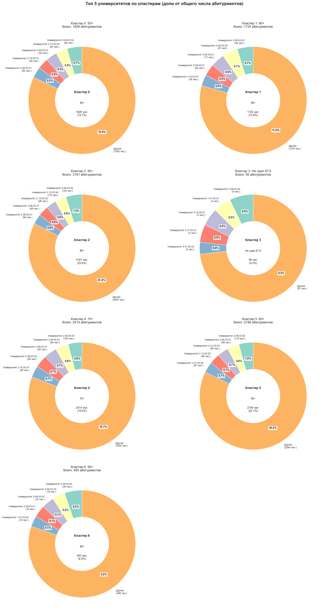

# Анализ оттока абитуриентов

Данные для анализа:
 * **11716** абитуриентов забравших документы из ТИУ
 * **250** университетов

Для анализа взяты только те абитуриенты, которые забрали документы из ТИУ.

## Топ 10 популярных университетов

1) ### <b>ТюмГУ</b> (52)
   - «Тюменский государственный университет» 
   - более 1750 абитуриентов
   
2) ### <b>УрФУ</b> (45)
   - «Уральский федеральный университет имени первого Президента России Б.Н. Ельцина»
   - около 1750 абитуриентов
3) ### <b>УГГУ</b> (130)
     - «Уральский государственный горный университет»
     - около 800 абитуриентов
4) ### <b>СПбПУ</b> (44)
    - «Санкт-Петербургский политехнический университет Петра Великого»
    - около 600 абитуриентов
5) ### <b>ТПУ</b> (51)
 - «Национальный исследовательский Томский политехнический университет»
 - примерно 550 абитуриентов
6) ### <b>УГНТУ</b> (104)
   - «Уфимский государственный нефтяной технический университет»
   - примерно 510 абитуриентов
7) ### <b>НГТУ</b> (29)
    - «Новосибирский государственный технический университет»
    - около 270 абитуриентов
8) ### <b>КНИТУ-КАИ</b> (196)
    - «Казанский национальный исследовательский технический университет им. А.Н. Туполева-КАИ»
    - около 270 абитуриентов
9) ### <b>СурГУ</b> (162)
   - «Сургутский государственный университет»
   - примерно 260 абитуриентов
10) ### <b>Московский политех</b> (21)
    - «Московский политехнический университет»
    - около 250 абитуриентов

## Разбиение абитуриентов на группы по их баллам ЕГЭ

 

### Всего выделено 7 основных групп:
 - <b>0/b> - от 50 до 59 баллов (2132 абитуриента)
 - <b>1</b> -от 80 до 89 баллов (2007 абитуриентов)
 - <b>2</b> - от 65 до 69 баллов (3669 абитуриентов)
 - <b>3</b> - Не набрали порог (73 абитуриента)
 - <b>4</b> - от 70 до 79 баллов (2782 абитуриента)
 - <b>5</b> - от 60 до 64 баллов (3177 абитуриента)
 - <b>6</b> - 90+ баллов (626 абитуриентов)

## Дальнейший анализ по группам

### Топ 5 популярных университетов для каждой группы

### Топ 5 популярных направлений подготовки для каждой группы

Средний проходной балл в ТИУ в 2025 году составил 190 баллов (63,3 балла за один предмет), учитывая +- 20% получаем средний проходной балл варьируется от 152-228 (примерно от 51 до 76 баллов за один предмет).
Таким образом целевые группы это абитуриенты с баллами ЕГЭ от 150 до 240 (это группы: 1; 6; 3; 5)

### Средняя цена на обучение для каждой группы

### Средняя цена на обучение для каждой группы в ТИУ

### Средние проходные баллы и цены в топ 10 популярных университетов

## Карта перемещений абитуриентов

### Средние баллы ЕГЭ и заработная плата в городах

> Баллы ЕГЭ учитывались по предметам (русский + математика профиль + физика/информатика)

 - Тюмень - 209.6 (86 714)
 - Сургут - 207.5 (106 474)
 - Ханты-Мансийск - 208.9 (125 993)
 - Курган - 207.4 (98 379)
 - с.Викулово - 210.8 (97 222)
 - Иркутск - 200.6 (92 830)
 - Оренбург - 207.9 (70 658)
 - Тара - 166.9 (52 400)
 - Тобольск - 196.1 (107 186)